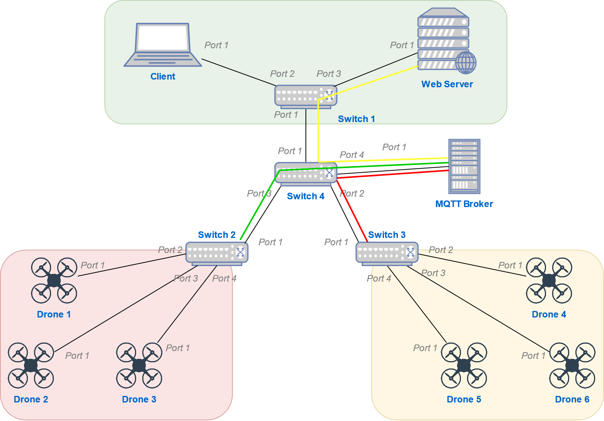

# Drones GPS tracker

## Project description

This project has been implemented by the following contributors as part of the PhD course [Computing in Communication Networks](https://ict.unitn.it/node/889):

* [Francesco Riz](https://webapps.unitn.it/du/it/Persona/PER0185299)
* [Stefano Berlato](https://www.dibris.unige.it/berlato-stefano)
* [Khakim Akhunov](https://webapps.unitn.it/du/en/Persona/PER0230856/Didattica)

### Requirements

* The [comnetsemu](https://git.comnets.net/public-repo/comnetsemu) virtual machine

### Functionality

The topology of the system's network is presented in the figure below. The aim of the system is to allow the user to move the drones by sending a command to the web server and to observe the drones current position on a map in a web-browser. The functionality of the network's components are the following:

* Client 
  - sends the request to the web server containing ID and new coordinates (longitude and latitude) of a drone
  - displays the drones position in a web-browser
  - sends the request to the web server to generate a .kml file suitable for uploading to Google Maps application
* Web server
  - responds to the client, sending back an html web page or generating a .kml file
  - subscribes to a topic within MQTT protocol
  - publish a message within MQTT protocol when drone movement is needed
* MQTT broker (refer to the separate folder)
* Drone
  - moves to a new position
  - subscribes to a topic within MQTT protocol
  - publish a message within MQTT protocol when drone coordinates are required
* Controller
  - manages the SDN (Software Defined Network)

### Topology

The network is sliced into three parts delineated by different colors in the figure. Devices belonging to different subnets are not able to communicate to each other.



## Content of the project

TBD
```
.
├── mqtt_tests
│   ├── build_docker_images.sh
│   ├── connect_nodes.sh
│   ├── controller.py
│   ├── DockerfileDroneMQTTClient
│   ├── DockerfileMyDevTest
│   ├── DockerfileMyMosquitto
│   ├── drone_client_mqtt.py
│   ├── just_connect_mqtt.py
│   ├── mock_server_mqtt.py
│   ├── mosquitto.conf
│   ├── README.md
│   ├── topology.py
│   ├── topology_Riz.py
│   └── topology_w_o_images.py
├── README.md
├── topology.png
├── maps-compare.gif
└── webserver_mqtt_drones
    ├── build_docker_images.sh
    ├── connect_nodes.sh
    ├── Dockerfile.client
    ├── Dockerfile.drone
    ├── Dockerfile.mqtt
    ├── Dockerfile.webserver
    ├── drone_client_mqtt.py
    ├── mosquitto.conf
    ├── topology.py
    ├── topology_star.py
    └── webserver
        ├── app.js
        ├── bin
        │   └── www
        ├── package.json
        ├── public
        │   ├── javascripts
        │   │   └── mqtt.js
        │   └── stylesheets
        │       └── style.css
        ├── routes
        │   └── index.js
        └── views
            ├── drone.pug
            ├── index.pug
            └── move.pug
```

## How to Run
Go to working directory webserver_mqtt_drones

1. Build the images:
    ```bash
    sudo ./build_docker_images.sh
    ```
    or
    ```bash
    sudo bash build_docker_images.sh
    ```
2. Start mininet and docker containers:
    ```bash
    sudo python3 topology.py
    ```  
3. From WebClient (Xterm), start links web browser to observe the drones positions within Trento:
    ```bash
    links 10.0.0.8:3000/positions
    ```
4. To move any drone to a new random position, send the request (move?id=drone_id) to the WebServer:
    ```bash
    links 10.0.0.8:3000/move?id=drone3
    ```
5. To generate the map file (.kml) suitable for Google Maps app, send the following request to the WebServer:
    ```bash
    links 10.0.0.8:3000/genmap
    ```
6. To copy the file from the WebClient host, run the following command on your host machine:
    ```bash
    sudo docker cp WebClient:/root/positions.kml .
    ```
Note: the positions should be updated after each movement. For example, run 3, then 5, then 4. After that,  again 3 and 5. Doing so, you will have two different positioning files that can be compared on Google Maps.


